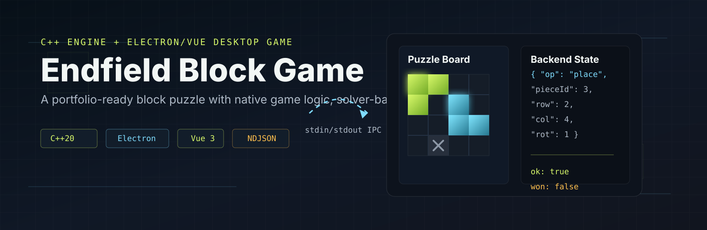
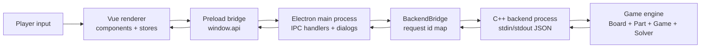
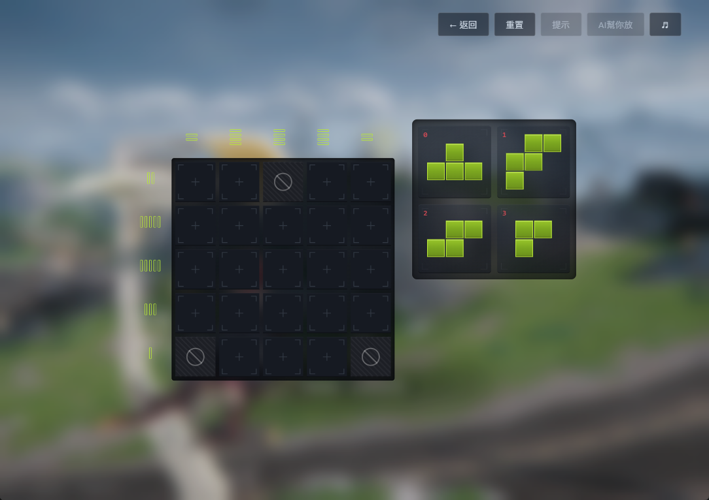

# Endfield Block Game



Endfield Block Game is a desktop block-puzzle game inspired by the
"Originium Circuit Repair" style of puzzle play. The player places and rotates
polyomino pieces on a grid until every row and column satisfies its required
colored-cell counts.

The project is intentionally split into a C++ game engine and an
Electron/Vue 3 desktop frontend. The backend is the source of truth for level
loading, placement validation, win detection, solver logic, and level
validation; the frontend renders state, handles smooth drag interactions, and
forwards user actions through a narrow IPC bridge.

## Features

- Desktop GUI built with Electron, Vue 3, and TypeScript.
- C++ backend for all rule logic, including collision checks, blocked cells,
  fixed cells, placement state, and win detection.
- Plain-text level format for shareable puzzle definitions.
- Level loading from local `.txt` files through native desktop dialogs.
- Drag-and-drop piece placement with live board preview.
- Keyboard rotation with `R`; dragged placed pieces can be removed with `Esc`
  or by dropping them back onto the piece panel.
- Single-color and two-color puzzle support.
- Row and column count indicators showing required and currently filled cells.
- Backtracking solver with pruning and duplicate-rotation elimination.
- Hint overlay and auto-solve actions, unlocked after a 30-second delay.
- Built-in level designer with board editing, piece editing, solver-backed
  validation, text export, file saving, and immediate playtesting.
- BGM and interaction sound effects.

## Tech Stack

| Layer | Technology |
| --- | --- |
| Game engine | C++20, CMake |
| Desktop shell | Electron, Electron Vite |
| Renderer UI | Vue 3, TypeScript, Composition API |
| Build/package tooling | pnpm, electron-builder |
| IPC | NDJSON-style JSON messages over child-process stdin/stdout |
| Styling | Scoped Vue CSS and shared CSS assets |

## Architecture Overview

The architecture keeps game authority in C++ while preserving a responsive UI.
The Vue renderer never spawns or talks to the backend process directly. Instead,
it calls the preload bridge, Electron main forwards the request to the C++
child process, and the backend returns one JSON response line with the matching
request id.



Detailed diagrams are available in [docs/architecture.md](docs/architecture.md).
Reusable Mermaid sources are stored in [docs/assets](docs/assets).

## Project Structure

```text
endfield-block-game/
|-- backend/
|   |-- include/              # C++ engine interfaces and data models
|   |-- src/                  # Board, game, part, file-loader, solver, IPC main
|   |-- tests/                # Sample level files and edge-case test data
|   `-- CMakeLists.txt        # Builds the backend executable target `main`
|-- frontend/
|   |-- resources/            # Icons, background image, BGM, sound effects
|   |-- src/main/             # Electron main process and C++ child lifecycle
|   |-- src/preload/          # Safe renderer-facing API bridge
|   `-- src/renderer/src/     # Vue components, stores, types, CSS assets
|-- docs/
|   |-- assets/               # README banner and Mermaid diagram sources
|   |-- public/md/            # Existing project documentation
|   |-- reports/              # Presentation/report material
|   `-- architecture.md       # Portfolio architecture write-up
|-- README.md
`-- LICENSE
```

## Installation

Prerequisites:

- CMake 3.28 or newer
- A C++20 compiler supported by CMake
- Node.js
- pnpm

Build the C++ backend:

```bash
cd backend
cmake -S . -B build
cmake --build build
```

Install frontend dependencies:

```bash
cd frontend
pnpm install
```

If pnpm is not available, install it with your preferred Node.js workflow
or enable it through Corepack if your Node installation supports it.

## How to Run

Start the desktop app in development mode:

```bash
cd frontend
pnpm dev
```

In development mode, Electron expects the backend executable at:

- Windows: `backend/build/main.exe`
- macOS/Linux: `backend/build/main`

Build the frontend bundle:

```bash
cd frontend
pnpm build
```

Create a Windows installer or unpacked build:

```bash
cd frontend
pnpm build:win
pnpm build:unpack
```

Packaging note: `electron-builder.yml` currently bundles the Windows backend
binary from `../backend/build/main.exe` and the sample level files. Cross-platform
backend bundling for macOS/Linux needs confirmation before release.

## Usage

1. Launch the app and choose "load level file" to open a `.txt` level.
2. Drag pieces from the side panel onto the board.
3. Press `R` while dragging to rotate the current piece.
4. Drop a piece on the board to ask the C++ backend to validate and commit it.
5. Drag a placed piece back to the panel, or press `Esc` while dragging it, to
   remove it.
6. Use the reset action to return the level to its initial state.
7. After the hint delay, enable the solver hint overlay or let the backend
   auto-place a complete solution.
8. Open the level designer to create, validate, export, save, and play custom
   levels.

## Key Implementation Details

- **C++ as source of truth:** placement legality, occupied cells, row/column
  counts, win detection, level parsing, level validation, and solver output are
  computed in C++.
- **NDJSON-style process protocol:** Electron main writes one JSON request per
  line to the backend and resolves the matching Promise when a response with the
  same `id` arrives.
- **Smooth drag architecture:** Vue handles per-frame pointer movement locally;
  only the final drop position is sent to C++ for validation.
- **Solver-backed designer:** the level designer generates the same text format
  used by normal levels, then calls `validateLevelString` so only solvable
  levels can be exported.
- **Backtracking solver:** pieces are sorted by size, symmetric rotations are
  de-duplicated, and branches are pruned when row/column targets would be
  exceeded.
- **State refresh pattern:** after mutating backend operations such as `place`,
  `remove`, `reset`, or `autoSolve`, the renderer refreshes the complete
  `GameState` from C++.

## Screenshots / Demo

Runtime screenshots should be captured from this project before publishing the
portfolio page. No screenshots are embedded yet so the README does not show
stale or unrelated UI.

Suggested screenshot paths:

| Screenshot | Suggested file |
| --- | --- |
| Start screen | `docs/assets/screenshots/start-screen.png` |
| Loaded puzzle with pieces | `docs/assets/screenshots/game-board.png` |
| Drag preview and placement validation | `docs/assets/screenshots/drag-preview.png` |
| Hint or auto-solve result | `docs/assets/screenshots/solver-hint.png` |
| Level designer validation | `docs/assets/screenshots/level-designer.png` |

Markdown embed examples after capturing:

```markdown



```

See [docs/screenshot-plan.md](docs/screenshot-plan.md) for a more detailed
capture checklist.

## Challenges and Learnings

- Designed a clear responsibility boundary between a systems-style C++ engine
  and a modern desktop frontend.
- Built a small but reliable process protocol with request ids, line-delimited
  JSON, backend lifecycle management, and renderer-safe APIs.
- Balanced UI responsiveness with backend authority by keeping drag previews in
  Vue and final validation in C++.
- Implemented a solver that is practical for puzzle validation by combining
  backtracking with simple pruning heuristics.
- Learned the packaging concerns that appear when a desktop frontend depends on
  a native executable.

## Future Improvements

- Add automated CI that builds the backend and type-checks/lints the frontend.
- Add backend regression tests that run sample and edge-case levels.
- Add release-ready screenshot and demo GIF assets.
- Improve packaged release support for macOS and Linux backend binaries.
- Replace placeholder/scaffold metadata that is still present in some generated
  Electron files if producing a public release.
- Add richer piece textures or visual materials; the roadmap currently marks
  this item as not complete.
- Add solver progress/cancellation feedback for larger custom levels.

## License

This project is licensed under the [MIT License](LICENSE).

## Additional Documentation

- [Architecture write-up](docs/architecture.md)
- [IPC protocol](docs/public/md/protocol.md)
- [Backend logic and solver](docs/public/md/backend.md)
- [Frontend architecture](docs/public/md/frontend.md)
- [Level format](docs/public/md/level-format.md)
- [Level designer](docs/public/md/designer.md)
- [Development and packaging notes](docs/public/md/development.md)
- [Edge-case testing notes](backend/tests/more_tests/edge-cases.md)
