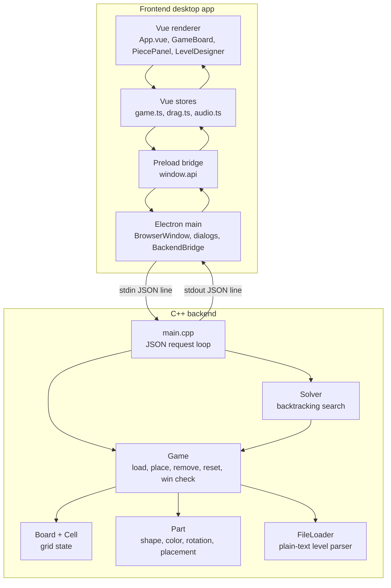
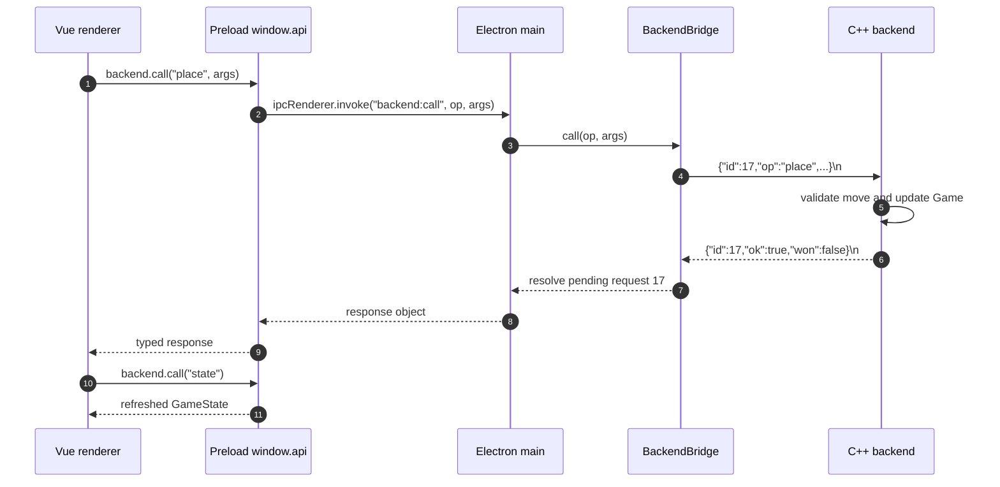
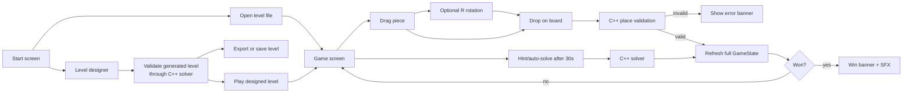

# Endfield Block Game Architecture

This document summarizes the verified architecture of the repository for
portfolio and interview use. It is based on the checked-in source code under
`backend/`, `frontend/`, and `docs/public/md/`.

## Purpose

Endfield Block Game is a desktop puzzle game where the player places colored
polyomino pieces on a grid. A level is solved when each color satisfies every
row and column count target. The project demonstrates a native C++ game engine
integrated with a modern Electron/Vue desktop interface.

## System Architecture

Mermaid source: [docs/assets/system-architecture.mmd](assets/system-architecture.mmd)

## Frontend to Backend IPC

Mermaid source: [docs/assets/ipc-flow.mmd](assets/ipc-flow.mmd)

## Game Flow

Mermaid source: [docs/assets/game-flow.mmd](assets/game-flow.mmd)

## Verified Runtime Boundary

- `frontend/src/main/index.ts` starts the backend executable as a child process.
- `frontend/src/preload/index.ts` exposes `window.api.backend.call(...)`.
- `frontend/src/renderer/src/api/backend.ts` wraps backend operations into typed
  methods such as `load`, `state`, `place`, `remove`, `solve`, and `autoSolve`.
- `backend/src/main.cpp` reads one request line at a time, switches on `op`, and
  writes one response line with the same `id`.
- `backend/src/game.cpp` owns placement rules and win detection.
- `backend/src/solver.cpp` owns solver search and solution generation.

## Current Protocol Operations

| Operation | Purpose |
| --- | --- |
| `load` | Load a level file from disk. |
| `loadString` | Load a level from generated text. |
| `validateLevelString` | Parse a generated level and verify that the solver can find a solution. |
| `state` | Return the complete current `GameState`. |
| `place` | Attempt to place or rotate a piece at a board coordinate. |
| `remove` | Remove a placed movable piece. |
| `reset` | Restore the current level to its initial state. |
| `solve` | Return one valid solution without applying it. |
| `autoSolve` | Solve and apply the returned placement list to the game. |
| `quit` | Acknowledge and exit the backend loop. |

## Needs Confirmation Before Public Release

- Whether macOS/Linux packaged builds include a matching backend binary. The
  checked-in `electron-builder.yml` explicitly lists `main.exe` for Windows.
- Final screenshot/demo assets. The repository currently contains project
  images and report material, but the portfolio README should use fresh runtime
  screenshots captured from this app.
- Whether the public release should retain the fan-project "Endfield" naming or
  use a more generic portfolio title.

